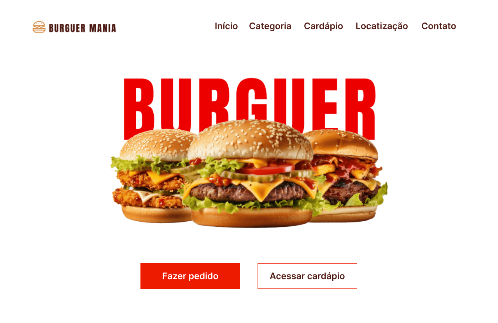

# Burger Mania - Frontend

## Funcionalidades

- **Componentização**: Contém componentes reutilizáveis, como Header, Botão, Card, Descrição e Input.
- **Roteamento**: Navegação entre as páginas de Pedido e Cardápio, com suporte a categorias específicas.
- **Estilos Globais com Variáveis CSS**: Define variáveis para cores e tipografia, aplicadas em todos os componentes.

## Estrutura do Projeto

- **src/app/components**: Contém os componentes reutilizáveis (Header, Botão, Card, Descrição e Input).
- **src/app/views**: Contém as páginas principais do projeto (Pedido, Cardápio, Categoria).
- **src/styles.css**: Arquivo de estilos globais, onde estão definidas as variáveis CSS.

## Requisitos do Projeto

- **Página de Home**: Exibe o Header e botões de fazer pedido e acessar cardápio.
- **Página de Cardápio**:
  - Lista categorias de hambúrgueres.
  - Redireciona para uma página com os itens disponíveis ao selecionar uma categoria.
- **Página de Detalhes**: Exibe informações do pedido com preço e descrição detalhada.
- **Página de Pedido**: Exibe informações inputs de quantidade e observações.


## Configuração Inicial

Instale as dependências do projeto:
   
   ```bash
   npm install
   ```
## Executando o Projeto

Iniciar o servidor de desenvolvimento e executar o projeto:

```bash
ng serve
```
